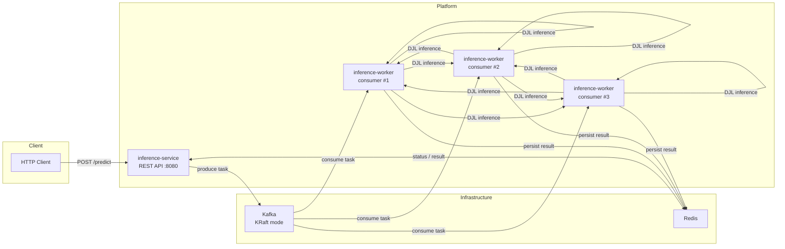

# Deep Learning Platform

[](https://adoptium.net/)
[](https://spring.io/projects/spring-boot)
[](https://kafka.apache.org/)
[](https://redis.io/)
[](https://djl.ai/)

An asynchronous, event-driven microservices platform for deep learning image classification.
Built with Spring Boot, Apache Kafka (KRaft mode), Redis, and DJL (Deep Java Library).

---

## Architecture



The `inference-service` accepts image classification requests and publishes them to Kafka.
Multiple `inference-worker` instances consume tasks in parallel, run inference via a
pre-trained ResNet-18 model, and store results in Redis. The client polls for status
and retrieves results through the REST API.

---

## Tech Stack

| Component | Technology | Purpose |
|-----------|-----------|---------|
| Runtime | Java 17 | Application language |
| Framework | Spring Boot 3.2.5 | DI, web, messaging, configuration |
| Message Broker | Apache Kafka 7.5.3 (KRaft) | Decoupled task queue |
| Cache / State | Redis 7 | Job status and result storage |
| ML Engine | DJL 0.26.0 + PyTorch | ResNet-18 image classification |
| Container | Docker + Docker Compose | Local dev and deployment |
| Build | Maven 3.9 (multi-module) | Compile, test, package |

---

## How It Works

1. **Submit a prediction** — `POST /api/v1/predict` with an image URL. The service generates a job ID, saves `PENDING` status to Redis, and publishes the task to Kafka.

2. **Task processing** — A worker picks up the Kafka message, updates Redis to `PROCESSING`, downloads the image, runs it through ResNet-18 (DJL/PyTorch), and stores top-5 classifications in Redis with `COMPLETED` status.

3. **Poll for results** — The client polls `GET /api/v1/status/{jobId}` until the status is `COMPLETED`, then calls `GET /api/v1/result/{jobId}` to retrieve classifications.

4. **Error handling** — If inference fails, the worker sets the job to `FAILED` with an error message. All Redis keys expire after 24 hours.

---

## Prerequisites

- **Java 17** or higher
- **Docker** and **Docker Compose** (for local infrastructure)
- **Maven Wrapper** is included (`./mvnw`), no global Maven install needed

---

## Quick Start

```bash
# 1. Clone the repository
git clone https://github.com/SebastianOrtiz2194/deepLearning.git
cd deepLearning

# 2. Start infrastructure (Kafka, Redis, apps)
docker-compose up -d

# 3. Submit a classification job
curl -X POST http://localhost:8080/api/v1/predict \
  -H "Content-Type: application/json" \
  -d '{"imageUrl":"https://upload.wikimedia.org/wikipedia/commons/4/4d/Cat_November_2010-1a.jpg"}'

# Response (202 Accepted)
# {"jobId":"abc-123...","status":"PENDING","message":"Job accepted and queued for processing"}

# 4. Check job status
curl http://localhost:8080/api/v1/status/abc-123...

# Response (200 OK)
# {"jobId":"abc-123...","status":"PROCESSING"}

# 5. Retrieve results once completed
curl http://localhost:8080/api/v1/result/abc-123...

# Response (200 OK)
# {
#   "jobId":"abc-123...",
#   "status":"COMPLETED",
#   "result":{
#     "imageUrl":"https://...",
#     "classifications":[
#       {"label":"tabby cat","probability":0.92},
#       {"label":"tiger cat","probability":0.85},
#       ...
#     ]
#   }
# }
```

---

## API Reference

Base URL: `http://localhost:8080/api/v1`

### `POST /predict`

Submit an image for classification.

**Request body:**

```json
{
  "imageUrl": "https://example.com/photo.jpg"
}
```

| Field | Type | Required | Description |
|-------|------|----------|-------------|
| `imageUrl` | string | Yes | Publicly accessible image URL |
| `modelType` | string | No | Model identifier (reserved for future use) |

**Response:** `202 Accepted`

```json
{
  "jobId": "550e8400-e29b-41d4-a716-446655440000",
  "status": "PENDING",
  "message": "Job accepted and queued for processing"
}
```

### `GET /status/{jobId}`

Query the current lifecycle status of a job.

**Response:** `200 OK`

```json
{
  "jobId": "550e8400-e29b-41d4-a716-446655440000",
  "status": "PROCESSING"
}
```

Possible status values: `PENDING`, `PROCESSING`, `COMPLETED`, `FAILED`.

### `GET /result/{jobId}`

Retrieve classification results for a completed job.

**Response:** `200 OK` (includes `result` when complete)

```json
{
  "jobId": "550e8400-e29b-41d4-a716-446655440000",
  "status": "COMPLETED",
  "result": {
    "imageUrl": "https://example.com/cat.jpg",
    "classifications": [
      {"label": "tabby cat", "probability": 0.92},
      {"label": "Egyptian cat", "probability": 0.85},
      {"label": "tiger cat", "probability": 0.73},
      {"label": "lynx", "probability": 0.45},
      {"label": "Siamese cat", "probability": 0.32}
    ]
  }
}
```

### Error Responses

| Status | Condition |
|--------|-----------|
| `400` | Validation error (e.g., blank `imageUrl`) |
| `404` | Job ID not found |
| `503` | Kafka is unavailable |
| `500` | Unexpected server error |

---

## Project Structure

```
deepLearning/
├── pom.xml                          # Parent POM (Spring Boot 3.2.5, Java 17)
├── docker-compose.yml               # Kafka (KRaft), Redis, services
├── .env.example                     # Environment variable reference
│
├── common/                          # Shared library
│   ├── pom.xml
│   └── src/main/java/com/deeplearning/common/
│       ├── dto/
│       │   ├── KafkaTask.java           # Kafka message payload
│       │   ├── PredictionRequest.java   # Inbound request DTO
│       │   └── PredictionResult.java   # Classification result DTO
│       ├── enums/
│       │   └── JobStatus.java           # PENDING | PROCESSING | COMPLETED | FAILED
│       └── exception/
│           ├── InferenceException.java
│           ├── TaskNotFoundException.java
│           └── TaskSubmissionException.java
│
├── inference-service/               # REST API + Kafka producer
│   ├── pom.xml
│   ├── Dockerfile                       # Multi-stage (Maven → JRE Ubuntu)
│   └── src/main/java/com/deeplearning/inference/
│       ├── InferenceServiceApplication.java
│       ├── controller/
│       │   └── InferenceController.java     # POST /predict, GET /status, GET /result
│       ├── dto/
│       │   └── PredictionResponse.java
│       ├── service/
│       │   ├── TaskProducerService.java     # Kafka publisher
│       │   └── TaskResultService.java       # Redis read/write
│       └── exception/
│           └── GlobalExceptionHandler.java  # @ControllerAdvice
│
└── inference-worker/                # Kafka consumer + DJL engine
    ├── pom.xml
    ├── Dockerfile                       # Multi-stage (Maven → JRE Ubuntu)
    └── src/main/java/com/deeplearning/worker/
        ├── WorkerApplication.java
        ├── config/
        │   ├── DjlConfig.java               # ResNet-18 model bean
        │   └── KafkaConsumerConfig.java     # Error handler + backoff
        ├── consumer/
        │   └── InferenceConsumer.java       # @KafkaListener (concurrency=3)
        ├── engine/
        │   ├── InferenceEngine.java         # Interface
        │   ├── DjlInferenceEngine.java      # Real DJL/ResNet-18 (active by default)
        │   └── StubInferenceEngine.java     # Deterministic stub (@Profile "stub")
        └── service/
            └── ResultPersistenceService.java # Atomic Redis writes
```

---

## Testing

Run all tests with the stub profile (no model download needed):

```bash
./mvnw clean test -Dspring.profiles.active=stub
```

| Module | Tests | Description |
|--------|-------|-------------|
| `inference-service` | 15 | Controller (6), Producer (2), Result Service (5), E2E (2) |
| `inference-worker` | 8 | Consumer (3), Stub Engine (3), DJL Engine (2 — disabled by default) |

The `DjlInferenceEngineTest` is `@Disabled` by default because it requires the DJL
PyTorch native runtime (~200 MB) and ResNet-18 model download (~45 MB). To run it:

```bash
./mvnw test -pl inference-worker -Dtest=DjlInferenceEngineTest -Dspring.profiles.active=dev
```

---

## Profiles

| Profile | Effect |
|---------|--------|
| `dev` (default) | DEBUG logging, all components active |
| `prod` | INFO logging, real DJL engine |
| `stub` | Uses `StubInferenceEngine` — deterministic results, no model download |

Set via `SPRING_PROFILES_ACTIVE` environment variable or `-Dspring.profiles.active=`.

---

## Future Improvements

- **Dead-Letter Queue (DLQ)** — Route failed tasks to a dedicated Kafka topic for
  inspection and replay. The current `KafkaConsumerConfig` already logs exhausted
  retries at the point where a DLQ producer would be wired.

- **Prometheus + Grafana** — Expose metrics for job throughput, processing latency,
  error rates, and Redis/Kafka health via Micrometer + Actuator.

- **Model hot-swapping** — Support multiple model types per request via the
  `modelType` field in `PredictionRequest`, enabling runtime model selection.

- **Kubernetes manifests** — Add Helm charts or Kustomize overlays for production
  deployment with horizontal pod autoscaling on the worker Consumer Group lag.
